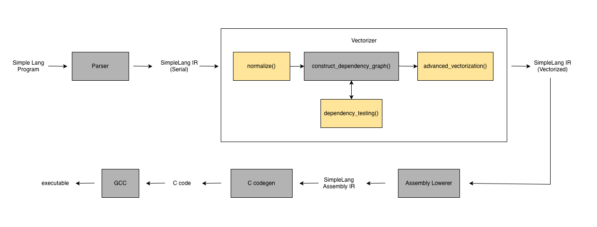

# Homework 4: Auto-Vectorizer

**Due Date:** TBD

## Table of Contents
* [Problem statement](#problem-statement)
    * [Task Description](#task-description)
        * [Deliverables](#deliverables)
        * [Tests](#tests)
    * [SimpleLang](#simple-lang)
        * [Language Specification](#language-specification)
        * [Key Compiler Components](#key-compiler-components)
* [Instructions](#instructions)
    * [Getting Set up](#getting-set-up)
    * [Getting Started with PACE](#getting-started-with-pace)
    * [Running our Code](#running-our-code)
* [Grading](#grading)
    * [Submission Details](#submission-details)
* [Documentation](#documentation)
* [References](#references)

---

# Problem Statement
This assignment requires students to implement a vectorizer for the `SimpleLang` compiler. 

## Task Description
Your goal is to rewrite serial `SimpleLang` code to its vector variant. An example is as follows (more examples are available [here](tests/test_vectorize.py)).

```
## Input ##
function vectorizable1(A[16]) -> [16]:
    for i in range(0,16,1)
        A[i] = 0
    end
    return A
end       

## Output ##
function vectorizable1(A[16]) -> [16]:
    A[0:16] = 0
    return A
end
```

### Deliverables
The rewrite can be achieved by implementing the following functions.

1. `normalize()` 
    - Located at: [src/autovec/simple_lang/vectorizer/normalize.py](src/autovec/simple_lang/vectorizer/normalize.py)
    - Normalize loop bounds.

2. `dependency_test()`
    - Located at: [src/autovec/simple_lang/vectorizer/dependency_testing.py](src/autovec/simple_lang/vectorizer/dependency_testing.py)
    - Implement three dependency tests: `ZIV` (Zero Index Variable), `Strong SIV` (Single Index Variable), and `Weak Zero SIV` to determine if dependencies exist within loop ranges
    - Returns dependency edges detected between the statements, or empty if no dependencies exist

3. `advanced_vectorization()` 
    - Located at: [src/autovec/simple_lang/vectorizer/vectorize.py](src/autovec/simple_lang/vectorizer/vectorize.py)
    - Recursively vectorize loop structures by analyzing the dependency graph using advanced vectorization algorithm.

### Tests

* **[tests/test_dependency_testing.py](tests/test_dependency_testing.py)**
  - Test the `dependency_test` function to identify that all dependencies have been captured.

* **[tests/test_vectorize.py](tests/test_vectorize.py)**
  - Test the `advanced_vectorization` function to ensure that vectorizable statements have been vectorized.

* **[tests/test_execute.py](tests/test_execute.py)**
    - Validates compilation and execution of vectorized SimpleLang code
  - **Note:** Requires a processor supporting Intel AVX-512

## SimpleLang

### Language Specification
SimpleLang is a "simple" programming language with a limited set of constructs for processing arrays. Some properties are as follows

1. The language operates exclusively on 64-bit float tensors.
2. All SimpleLang code is enclosed within a function. Inputs and their shapes are specified in the function header. SimpleLang does not support memory allocation; instead, all buffers must be pre-allocated and provided as inputs. Values are returned using the `return` keyword.
    ```
        function simple_prgm(A[10,10]) -> [10]:
            ...
            return A
        end
    ```
3. Tensors use bracket notation with 0-based (C-style) indexing.
    ```
        A[i]   : (i+1)th element in 1D tensor A
        A[i,j] : (i+1,j+1)th element in 2D tensor A
    ```
4. SimpleLang only supports addition (`+`), subtraction (`-`), and multiplication (`*`). These operations apply to indices as well. Assignment uses the `=` operator.
    ```
        A[i] = A[i] * 2
        A[i+1] = A[i]
    ```
5. SimpleLang supports vector operations. `A[0:10]` represents all elements from index 0 to 9. Strided access is also supported: `A[0:10:2]` accesses indices 0 to 9 with stride 2. 
    ```
        A[0:10] = A[0:10] * 2
        A[0:10:2] = A[0:10:2] * 2
    ```

     **Note:** SimpleLang abstracts vector ranges from the underlying machine's vector width. Users can specify any vector range, and the compiler automatically maps it to the target processor's hardware vector width (this is already implemented for you).
6. SimpleLang supports for-loops. `range(0,10)` iterates from 0 to 9 in the forward direction only. Strided loops use an additional parameter: `range(0,10,2)` iterates with stride 2.
    ```
        for i in range(0,10)
            A[i] = A[i] + 12
        end

        for i in range(0,10,2)
            A[i] = A[i] + 12
        end
    ```
7. SimpleLang does not support
    - Use of index expressions within vector ranges (i.e. `A[i:i+10]`) is not supported. 
    - Multidimensional vectorization  (i.e. `A[1:10,1:10]`) is not supported

### Key Compiler Components



The compiler consists of several key components. At a high level, a SimpleLang program is first parsed to produce a SimpleLang IR. This IR is then analyzed by the vectorizer, which rewrites eligible serial sections into their vector equivalents. The resulting vectorized IR is lowered to SimpleLangAssembly, where vector statements are represented using intrinsics. Finally, SimpleLangAssembly is translated to C code, which is compiled using GCC.

Students are only required to implement the blocks highlighted in yellow (the functions listed in the task description); all other components have already been implemented for you.


To aid your implementation, it may be helpful to review the following files.

1. `src/autovec/simple_lang/vectorizer/dependency_graph.py` : This file specifies the following
    - Defines the nodes and edges of a dependency graph.
    - Constructs a dependency graph by calling the `dependency_testing()` method implemented by the student
2. `src/autovec/simple_lang/nodes.py` : These are the nodes associated with the SimpleLang IR.

# Instructions

## Getting Set Up

The starter code is available on [GitHub](https://github.com/Parallelizing-Compilers/Homework4) and should work out of the box. To get started, we recommend you log in to PACE-ICE and download the assignment.

> [!WARNING]
>
> Tasks requiring heavy compute on the login node will be automatically killed and may result in account suspension. You must use salloc to allocate a compute node before running this assignment.

## Getting Started with PACE

If you are new to the PACE cluster, please ensure you are connected to the GT VPN. You will be logging into the ICE cluster environment.

Please read through the PACE tutorial, available here: [https://gatech.service-now.com/home?id=kb_article_view&sysparm_article=KB0042102](https://gatech.service-now.com/home?id=kb_article_view&sysparm_article=KB0042102)

To get started, log in to the PACE login node and clone the assignment.
```
student@local:~> ssh <gatech_username>@login-ice.pace.gatech.edu
student@login-ice-1:~> cd scratch
student@login-ice-1:~> git clone https://github.com/Parallelizing-Compilers/Homework4.git
student@login-ice-1:~> cd Homework4
```

### Moving to a Compute Node

Command to request an [interactive session](https://gatech.service-now.com/home?id=kb_article_view&sysparm_article=KB0042096#interactive-jobs): [We will be making use of a single Intel Xeon Gold 6226 processor]
```
student@login-ice-1:~> salloc -N 1 -n 1 -t <session-time> -C gold6226
student@atl1-1-02-003-19-2:~>
```

Once the command is granted, your terminal prompt will change (e.g., to `[student@atl1-1-02-003-19-2]$`). You are now on a compute node.


On Pace ICE, we use any [Dual Xeon Gold 6226 processor](https://gatech.service-now.com/home?id=kb_article_view&sysparm_article=KB0042095). The reference machine is Intel(R) Xeon(R) Gold 6226 CPU @ 2.70GHz (turbo boost is disabled). There are two [VPUs](https://cvw.cac.cornell.edu/vector/hardware/vector-processing-unit#:~:text=Vector%20processing%20units%20(VPUs)%20perform%20the%20actual,are%20equipped%20with%20two%20VPUs%20per%20core) per core, each with 512-bit vector width, so 8 double-precision (64-bit) elements can be processed in parallel. Each VPU has FMA units. The [manual](https://www.intel.com/content/www/us/en/products/sku/193957/intel-xeon-gold-6226-processor-19-25m-cache-2-70-ghz/specifications.html) contains additional details.

## Running the Code
1. Install the dependencies with:
    - On PACE:
        ```bash
        module load python/3.12.5
        python3 -m venv hw4
        source hw4/bin/activate
        pip install -r requirements.txt
        pip install .
        ```
    - On Personal Machine:
        ```bash
        poetry install --extras test
        ```
2. Run tests with:
    ```bash
    $ pytest tests/test_dependency_testing.py
    ```
3. To inspect the compiled C code, edit `scripts/prgm.smpl` with your SimpleLang program and run:
    ```bash
    scripts$ python smpl2c.py
    ```
    The output is written to `code.c`.


# Grading
## Submission Details
1. Students are required to submit a zipped `src/` directory on canvas.
2. Please ensure your code is tested and verified on a PACE machine before final submission. Passing test cases on this specific machine will be the sole basis for grading.
3. You are free to add additional methods to help better organize your code but do not modify the interface of any provided functions or edit files outside those specified in the task description.
4. Apart from the tests included here, the submissions will be graded on a set of hidden test cases.

# Documentation

* [ICE's programming environment](https://gatech.service-now.com/home?id=kb_article_view&sysparm_article=KB0042102) documentation
* [Intel's intrinsics guide](https://software.intel.com/sites/landingpage/IntrinsicsGuide/#techs=AVX2,FMA) - a complete overview of all available vector intrinsics.

# References

*  Randy Allen and Ken Kennedy, Optimizing Compilers for Modern Architectures, Morgan-Kaufmann, Second Printing, 2005.
